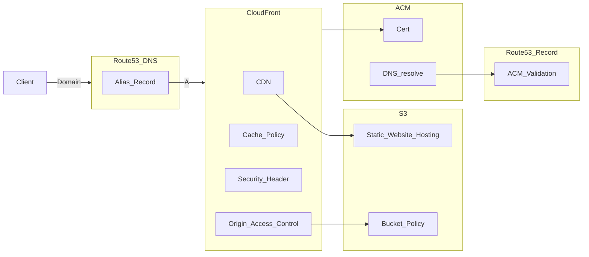

```mermaid
graph LR

subgraph Route53_DNS
  Alias_Record
end

subgraph CloudFront
  CDN
  Cache_Policy
  Security_Header
  Origin_Access_Control
end

subgraph S3
  Bucket_Policy
  Static_Website_Hosting
end

subgraph ACM
  Cert
  DNS_resolve
end

subgraph Route53_Record
  ACM_Validation
end


Client --Domain--> Route53_DNS
Alias_Record --A--> CloudFront

DNS_resolve --> ACM_Validation

CloudFront --> Cert

Origin_Access_Control --> Bucket_Policy

CDN --> Static_Website_Hosting
```