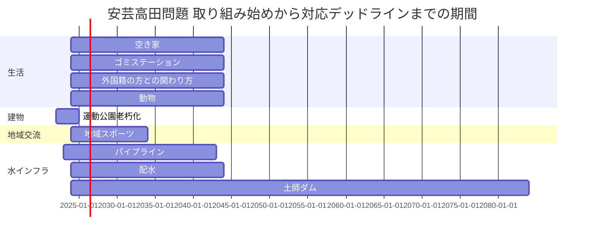

# 問題ガントチャート

- 生活
  - 空き家
    - 地元の人しかわからん
  - ゴミステーション
  - 外国籍の方との関わり方
  - 動物
- 建物
  - 運動公園老朽化

- 地域交流
  - 地域スポーツ
- 水インフラ
  - パイプラインメンテナンス
  - 配水
  - ダム
    - 60年後決壊

# 同窓会
- Google Form 作成
- 仮予約 4/28 18:00 - 20:00  or 17:00 - 19:00 
  - いつまでに正式予約に切り替えるかを聞く
- 3/11 20:00 みんなでテスト
- Lineに流す

