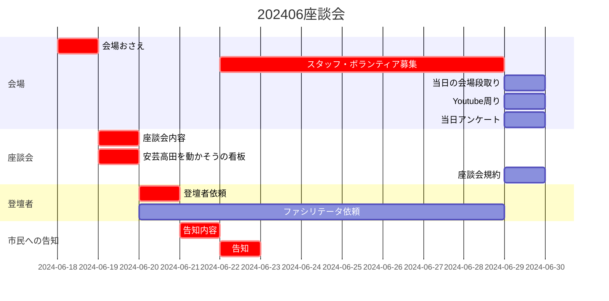

# 20240630座談会プラン

## 会場
- 会場おさえ
  - 小ホール
  - 登壇者控室
- スタッフ・ボランティア募集
- 当日の会場段取り
- Youtube配信
- 当日アンケート

## 座談会
- 座談会内容・段取り
- 安芸高田を動かそうの看板・メインページ
- 座談会規約

## 登壇者
- 依頼
  - 市長立候補
  - ファシリテータ

## 市民への告知
- 告知内容
  - 市民アンケート
- 告知
  - SNS
  - LINE
  - マスコミ

### クリティカルパス
[会場おさえ]  
↓  
[安芸高田を動かそうの看板場所、 座談会内容・段取り]  
↓  
[登壇者依頼]  
↓  
[告知内容]  
↓  
[告知, スタッフ・ボランティア募集]  

### スケジュール

## 各種詳細

### 看板
X, Facebookのアカウント名相談... AKTKT?

